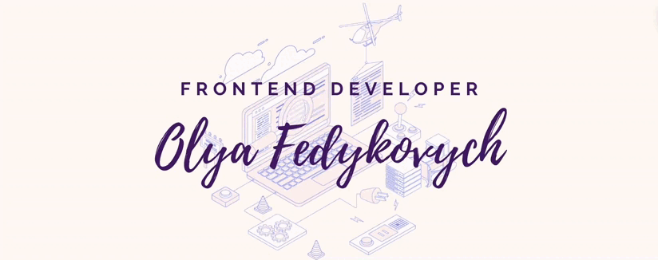

Hi! I’m Olya, a Front End Developer driven by passion for creating distinctive and functional user interfaces. My primary focus is implementation of user-centric web applications which align with company and user requirements. To achieve this goal, I leverage technologies including JavaScript, React, Redux, CSS/Sass and Node.js/Express.

## Skills

 
 
## Projects

